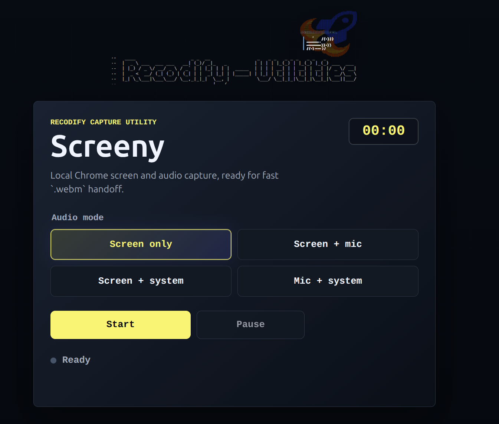

# Screeny

Barebones Chrome screen recorder from the Recodify Utilities set, built for local `.webm` captures.


## Features

- Screen recording.
- Optional microphone audio.
- Optional Chrome tab/system audio when the selected source supports it.
- Mixed microphone + tab/system audio when both are enabled.
- Start, stop, pause, resume, elapsed timer, and download.
- Keyboard shortcuts while the page has focus:
  - `R` starts or stops recording.
  - `P` pauses or resumes recording.
  - `Escape` stops recording.

## Requirements

- Chrome or another browser with `getDisplayMedia` and `MediaRecorder` support.
- A secure browser context. `localhost` works; plain HTTP on a remote hostname does not.

System/tab audio is controlled by Chrome's screen-share picker. If Chrome does not provide an audio track for the selected source, Screeny records the screen and shows a warning.

## Run With Docker

Build and serve on port `8765`:

```bash
docker build -t screeny . && docker run --rm -p 8765:80 screeny
```

Open:

```text
http://localhost:8765/
```

Docker uses `-p` or `--publish` for port mappings, so `-p 8765:80` maps local port `8765` to nginx port `80` inside the container.

## Run Without Docker

Serve the static files from this directory:

```bash
python3 -m http.server 8765
```

Open:

```text
http://localhost:8765/
```

## Manual Checks

Because browser capture requires user gestures and Chrome permission UI, verify manually in Chrome:

- Screen only records and downloads.
- Screen + mic records microphone audio.
- Screen + system records tab/system audio when Chrome shares it.
- Mic + system records both sources.
- Pause/resume works.
- `R`, `P`, and `Escape` shortcuts work while the page has focus.
